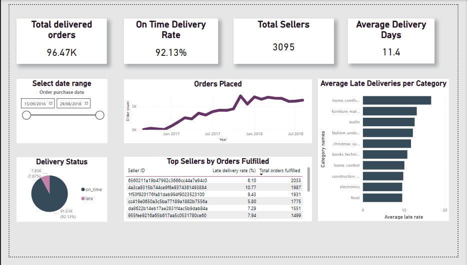

# Olist Supply Chain Analysis
Analysis of delivery performance and seller reliability across the Olist (Brazilian e-commerce platform), identifying high-risk product categories and underperforming sellers to support operational decision-making.

## Business Problem
**How reliable is the Olist supply chain, and which sellers and product categories are putting delivery performance at risk?**

- What is the overall on-time delivery rate, and how has it trended over time?
- Which product categories have the worst delivery performance?
- Which sellers have the highest late delivery rates — and are they high volume or low volume?
- How does estimated vs actual delivery time vary — are estimates systematically wrong?
## Data & Tools

E-commerce dataset downloaded from Kaggle - overall minimal cleaning was needed, few points to note: 
- due to confidentiality of real world data, seller IDs were hidden. This reflects in long strings of letters and numbers in Seller IDs in the final dashboard.
- the main language of this dataset is Brazilian - whilst the English translation of product categories was given, in some instances the translation is less than perfect.
- the dataset actually covers a fairly short amount of time with data missing for some months. This was highlighted in data cleaning and visualised in the dashboard.
- dataset consisted of 9 tables, covering orders, products, sellers, customers, payments, geolocation with translation table included.
- 6 views created to clean and pre-aggregate data for PowerBI dashboard. 
SQL used to data cleaning and analysis (SQL Server as the RDMS). PowerBI used for data visualisation/dashboard.
## Key Findings

- the dataset features over 3,000 sellers fulfilling almost 100,000 orders - a high seller-to-order ratio indicating a fragmented marketplace dominated by low-volume sellers. Seller analysis was filtered to high-volume sellers only to surface meaningful performance insights. Notably, the second largest seller by order volume had a late delivery rate exceeding 10%, representing a significant operational risk worth investigating.
- average delivery time from placing the purchase order to delivery is just over 11 days - quite a lot, even for a country the size of Brazil.
- the biggest sellers by order amount have around 6-10% lateness rate. 
- overall on-time delivery rate - 92.13%
- worst delivery rates are for categories featuring large, bulky items - furniture, mattresses, home appliances.
## Files
- `01_OLIST_cleaning_nulls.sql` — null checks across key tables
- `02_OLIST_duplicates_check.sql` — duplicate checks across key tables  
- `03_OLIST_cleaning_main.sql` — data type corrections and column updates
- `04_OLIST_views.sql` — 6 views created for analysis and Power BI
- `05_OLIST_exploratory_insights.sql` — exploratory queries, date ranges, order volumes
- `06_OLIST_analysis.sql` — core delivery performance and seller analysis
- `olist_dashboard.pdf` — Power BI dashboard export
